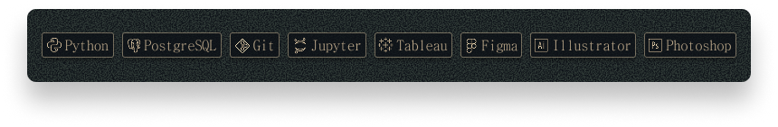

<!--
**jlnsabreu/jlnsabreu** is a ✨ _special_ ✨ repository because its `README.md` (this file) appears on your GitHub profile.

Here are some ideas to get you started:

- 🔭 I’m currently working on ...
- 🌱 I’m currently learning ...
- 👯 I’m looking to collaborate on ...
- 🤔 I’m looking for help with ...
- 💬 Ask me about ...
- 📫 How to reach me: ...
- 😄 Pronouns: ...
- ⚡ Fun fact: ...
-->

---

<div align="center">


**collections analyst → data analyst (in progress)**

I come from a world of tracking, cataloguing, and making sense of complex information.  
Turns out that's just data analysis with different job titles.

Now I'm building the technical side to match: writing real queries on real datasets,  
building tools in Python, and slowly learning how systems talk to each other.

---

### stack



---

### projects

| name | what it is | built with |
|------|-----------|------------|
| [mtg-collection-dashboard](https://github.com/jlnsabreu/mtg-collection-dashboard) | end-to-end pipeline: ManaBox exports → Scryfall API enrichment → Tableau dashboard. tracks mana curves, color distribution, legality, and collection composition. | Python, pandas, Scryfall API, Tableau |
| [sql-practice](https://github.com/jlnsabreu/sql-practice) | 31 DataLemur solved problems organised by concept | PostgreSQL |

</div>

---

<div align="center">

### currently

</div>

```
building    →  mtg-collection-dashboard (pipeline → analysis → viz)
learning    →  advanced sql, plotly and dash
next        →  a second project that isn't about magic cards
listening   →  the shins, kinda nostalgic these days
```

---
<div align="center">

### github activity

<p align="center">
  
  &nbsp;
  
</p>

---

### find me

[linkedin](https://linkedin.com/in/jsabreu) &nbsp;·&nbsp; open to data roles, collaborations, and recommendations for good datasets

</div>